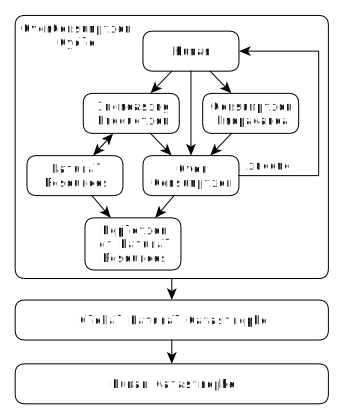

# Overconsumption vs. Human (Part 1)
by Simon Zolin, Nov 2020

Many people already know about the fact that overconsumption destroys our Nature.  There is an unstoppable consumption race that's running around us - a race with a goal to consume more.  While chasing the latest fashions, higher social status and satisfaction that comes from the possession of some thing, **we forget who we really are and why we live on this planet**.  Also, we don't even realize how long we are to live on Earth if we don't interrupt the current processes.  But inevitably, we will face the consequences of our doings.  It's better to act now rather than later.

Contents:

* [Modern consumption model](#model)
* [Consumption Propaganda](#propaganda)
* [Results of Consumption Propaganda](#results)
* [Results of Overconsumption](#rescons)
* [Conclusion](#conclusion)

## Modern consumption model

**The modern policy forces us to consume more and more**.  This is the foundation of this whole system - the consumption feeds it.  If consumption stops - everything falls apart.  Here I present to you a simple diagram that shows the current economic model and what consequences we should expect from it:

Now I'm going to describe what each block means in this diagram step by step.

* At the top of the chain I've placed a *Human*, because only he and his own needs is the main thing nowadays.  I don't divide people into classes or groups, because in our case it doesn't matter - **we all are the creators and at the same time the prisoners of this system**.  We're all equal on this earth, we all do what we choose to do.

* But this **Human wants only one thing - money**.  It means everything to him on his way to achieve his primary pleasures: good sleep, tasty food, being safe, etc.  Thus, there's not much more that can bring happiness to him but money.  The modern society does not understand nor encourage people who thinks differently.  A person who hasn't got money is considered to be poor, and therefore, weak and unhappy.  But is he really unhappy if he just cares little for those pieces of green paper and the things he can buy?  What if he cares more for his own ideas and his creativity?  There are thousands of things that a human being can place above his primordial instincts, but I'm not going to discuss it right away.  For now, I'm just going to describe my vision of the current behaviour of the society as a whole.  And the way I see it - Human only needs money.

	But how can he make money?  He needs to sell something - he must have a product (we'll leave out the fact that some people don't even do anything useful but are paid good money for that anyway).  And here's our next term - *Consumption* - it's the **process of someone willingly buying goods from another person**.

* But **to sell a product, it needs to be made first** - this is *Production*.  Note, that by "product" I mean here not just a thing that can be touched, but also a service (e.g. a haircut), because every type of service eventually comes down to a material thing (e.g. scissors).

* **To make any material thing, it requires a building material**.  And here our Nature comes to help us by providing us with *Natural Resources*.  A man takes the material (e.g. timber) and makes a product that he then sells (e.g. a chair).

* **The selling of a product generates an *income*** for the seller.  The customer pays for it by his own will because he needs it.  The seller, in his turn, also buys goods from another seller.  Both are happy with the deal.  This process is absolutely normal and fair.  The standard economic cycle is complete.

Now let's sum the things up and describe the whole process in just one sentence: **a man makes a product using natural resources, he sells it and receives an income that he then uses to buy goods that he needs**.  It seems like a very simple description, but this is the basic principle of economics.  This is how people help each other through their work.  If only we could stop at this point, there would be no problem.

But there is a human feeling we know as "greed for money".  While being under the influence of greed, Human starts searching for a way to increase his income no matter what.  How can he achieve that?  The answer is straightforward: a demand for his product must rise.  Thus, he needs to **increase the production**.  That's why there is "Increasing Production" and not just "Production" in our diagram - Human can't just keep his production at a constant moderate level.  On the one hand, it's a good thing because it often increases the number of people working in production - it creates additional jobs.  On the other hand, however, it also **increases the consumption of natural resources**, and this is a bad thing (it will be explained below).  Imagine that Human has made a large quantity of his product which must be all sold now.  Soon he's going to become very rich - this is the goal of his whole life, isn't it?

But now imagine that his product isn't selling well.  The demand is low, because no one needs it in so large quantities.  He doesn't get the income he was hoping for and he needs to do something to make people buy his product.  And here comes the machine of *Consumption Propaganda* - the catalyst for **raising the demand** for the goods, a very strong weapon of the capitalist upon the masses.

## Consumption Propaganda

In the past, the quality and the benefit of the product defined its demand on the market.  Now, neither the quality nor the benefit really define the demand.  Instead, the highly advanced technology of the modern **advertising creates the needed effect**, and it's doing the job even better than one could imagine.  As a result of advertising, the demand grows to a required level, and the seller receives an additional income.  Note, that an advertisement is in fact not just a usual commercial we see on our screens and in papers.  This kind of advertising is not so dangerous, because everyone knows what it is: its purpose is to make you consume.  But there is advertising that we don't usually recognize, yet it works much more stronger and penetrates deep into our consciousness.  **It lives within us for the whole lifetime, it even survives through generations.**  And it's called ideology.  But if the rules of social behaviour change, then the whole world starts to change dramatically.  And at some point the capitalist ideology has prevailed.  I'm sure there were times when young boys were dreaming of becoming a great artist, or a best blacksmith in the whole region, just because they wanted to express themselves through their work more than anything else in the world.  At least it was an ideal for many of them - to do what they love the most.  Just not so long ago the professions of a dream were a scientist and a pilot.  But now, what do the most children want to be when they grow up?  "Doesn't matter, just to make much money", they reply.  This is an example of transformation of moral principles through the time.

So what exactly does the modern ideology do?  It teaches us the specific behaviour by education, mass media and everything else that we see and hear.  It's inside every film, talk show video, article from the Internet, magazines and papers.  It's within the primary education.  It's inside every family.  All this is **constantly shaping the principles and affecting the behaviour** of young people.  They grow up and become the new consumers, more demanding than the previous - just as the system wants them to be.  They don't know that there are so many more ways to be happy in their lives, except that just making money and buying things.

For example, there's a hero in a movie who always smokes much.  And he does it in a way so cool, that we almost start to feel it ourselves.  As a result, the children may start smoking, they want to be cool too, they want to try it.  Although they know that smoking is just a bad habit of the adults, but in their consciousness there will always be an image of those great movie heroes that smoke, and it seems cool.

Here are several small examples.  We are taught how to be in fashion by TV shows.  We are taught the political beliefs by the biased news programs and talk shows.  Many articles and blogs on the Internet have a **goal to make us believe in something which is based on false assumptions**, hiding from us the important facts and opinions, or even feed us blatant lies.  Everything here depends on whose account this content serves, or in other words, whose interests a writer of this content lobbies.  But in my short description of Human I described that he cares only about money.  Thus, strictly speaking, the writer lobbies those who pay him the most.  This system is ideal for those who have much money - they have the real power in this world (at least while the world keeps living by these principles).

And what about education and family?  Modern education has only one purpose - to prepare an army of workers for the most demanded jobs.  Of course it's good because the people must have a profession, to do something useful in this world.  But at the same time the knowledge of this world and how it works inside is intentionally very limited.  It needs to be limited, otherwise the current system won't work so well.  As a result, we realize the most fundamental rules of our society, of our world, when we are at our 20s or even later, only through an extensive self-education.  And the children, while living in their families, see and learn everything from what's bothering their parents the most and what they talk about at dinner, to how they dress, what they buy and so on.  In the end, **the society is being formed with all those moral principles that the society teaches itself**.  It's also a cycle, like an economic cycle we've discussed earlier, and I'd like to call it "behaviour propaganda", and we'll talk more about it later.

## Results of Consumption Propaganda

Let's continue with our diagram.  What's the result of consumption propaganda?  It's *Overconsumption* - the purchasing of goods in large quantities, even if the consumer doesn't really need so much.  I repeat: he doesn't need so much, but he buys nevertheless.  Why is this happening?  It seems to us that we make this choice by ourselves, that we buy only what we need and in quantities that we need.  But unfortunately this is not completely true.  The system orders us to do so.  Everything around us **works 24 hours a day to make us buy something we don't need**.  Well, yes, there are many things that are really useful to us, but I'm talking just about quantity now.  We just can't stop wanting more and more.

For example, many of us have bought 5 or even more cell phones, and we don't do it only when our previous phone becomes broken.  Instead, the machine of consumption propaganda "injects" into us a very strong feeling that we want to buy a new one, because it has a larger screen and it has a redesigned emoji set.  Those who already bought it are now on the next level of their social status.  Those who haven't bought it yet will buy it eventually after they have realized they're out of fashion.  And there's nobody who can change our minds, who can show us that our old phones are just about the same.  No, **we buy just because we can**!  Furthermore, that's not that big of a deal if someone buys a new thing of fashion if he has spare money.  But those things are also bought by the customers who don't have any money at all.  And there's a convenient financial instrument called "credit" that is always ready to "help".  So the customer chooses by his own will to be in debt with interest, and all that is just for possessing a single thing, just for his self-indulgence.  Well, I described earlier that our Human here hasn't got any other forms of happiness anyway, so it's quite normal.

Though not directly related to consumption propaganda, but another very important factor that helps increasing the overconsumption is the "planned obsolescence".  Human willingly **makes a small defect in his product so it will surely break at some point**.  Imagine all electrical lamps in the world would work for a century without any problem - what would electric companies sell then?  No, the goal here is to make you buy a new product again and again, and for that the previous product must stop working, no doubt about that.

## Results of Overconsumption

Finally, after the phase of overconsumption, an increased income flows back to Human.  And it wouldn't be so bad if only our diagram was complete.  But there is one more block that we must talk about.  It's *Depletion of Natural Resources* and this is what makes this whole system flawed.  We're exhausting forests, oil, fresh water, oxygen in our atmosphere, fish and animals.  We've become less healthier ourselves with every new generation.  This **negative result of the overconsumption cycle** in the current economic model keeps building up each year.  And we do very little to minimize it.  Why?  Because it costs money and it doesn't generate income.  But Human doesn't care about anything that doesn't make him rich.  Considering the fact that there's no correct behaviour propaganda here (just overconsumption propaganda instead), there's **no place for a care for Nature**.  It's the other way around: we're welcome to use the maximum of available natural resources, exchanging them for that green paper we desire so much.  That's why we don't have Nature in this diagram but just Natural Resources instead.  But how long the Nature will allow us to live so carelessly?

With time, the pace of this cycle of overconsumption will start to decline due to depletion of natural resources.  This cycle can't keep going at the current speed forever.  On the other hand, the global pollution will play its role and start the downfall of food supply.  The **weather will change and some places will become inhabitable**.  But it still won't be a red signal for the world to stop doing what it's been doing for the past few centuries.  And that's because we've already lost our ability to make reasonable choices.  We always take everything we can without giving anything in return, and we just don't know there is another way.  In the end, the Nature will demand of the human to return his debt to her.  And I don't think she will be kind to us.  It will lead to the *Global Natural Catastrophe*.

And finally, the next stage of our great existence after the catastrophe of the nature will be a catastrophe of a human.  We forgot that we are too the part of the Nature, just another type of mammals living on our planet.  Although we tend to think that we are separate and free of any roots, but this is false, and deep down inside we all know it - we all depend on the Nature.  The change of climate and in economics will start **economic crises all over the world, mass hunger strikes and wars** for the last remaining resources.  The people will start killing each other just to be the first in line to apply for a job for which the boss will pay with food.  I don't know how about you, but I wouldn't want to live at such a time.

## Conclusion

So we have discussed the system which we see around us today and that can be found in many places of our planet.  This is a short description of it: **a greedy human with one and only goal in his life - money, creates an environment where everyone needs to buy a huge amount of goods, which results in an additional income to its seller.  During this process, so much natural resources are used that they start to decline with time.  Eventually, this cycle drives the humanity to a global catastrophe.**  This system is a failure right from the start and it's leaving us not much more time to act for changing it.  So what can we do to prevent the end of humanity?
