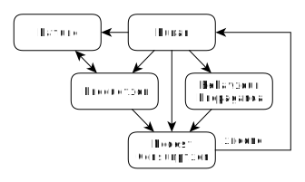

# Overconsumption vs. Human (Part 2): The Alternative
by Simon Zolin, Dec 2020

Contents:

* [Economic Model of the Future](#model)
* [Human and Nature](#human)
* [Social Behaviour](#behaviour)
* [Behaviour of the Future Society](#future)
	* [Advertising](#ad)
	* [Health and Lifestyle](#health)
	* [Education](#education)
	* [Care for Environment](#environment)
* [Conclusion: the Need for Changes](#conclusion)
* [P.S.: David Attenborough's Film](#david)

## Economic Model of the Future

Now let us consider another economic model, which is self-sustaining but at the same time it's friendly to the environment - it doesn't lead to a total destruction.

## Human and Nature

As you can see there is a *Human* at the top of the diagram too, just like in the diagram we examined in the previous chapter.  But notice that there's a *Nature* alongside Human now.  I place both of them at the same level, the highest level, because a Human in this model isn't just a selfish creature as in the previous model but a part of the Nature.  He understands this conception, and therefore he cherishes the Nature like it's his own family.

The care for the Nature can be of many forms: reduction of natural resources consumption such as tree cutting, reduction of hunting and fishing, reduction of air and water pollution.  Here, reduction means lowering the negative effects on the environment until this process stops being destructive to the nature, even if this means stopping the process entirely for some time.  Here's how he does it, for example:

* Human **continues fishing, but he does it moderately**, and so the fish in the water is never extinct.  More fish there is - more food for Human to consume sustainably.

* Human doesn't pollute the water, but **recycles the waste**.  And if there's no means to recycle it properly at the moment, then it's quite obvious that such waste can't be produced sustainably - it should not be produced in the first place.  After all, Human has an exclusive advantage over any other living thing on the planet - an ability to plan for the future.

* Human **doesn't increase the environmentally harmful production, but optimizes and reduces it** by using new effective technical solutions.  Effective not because they create profit to the business owners, but because they reduce the harmful effect on the nature.  And there's nothing that can fight with this idea but just human greed and egoism.  Of course it costs more in terms of money and manpower, but does it matter?  Human has much time ahead of their species and the highest priority is to think about the long-term survival, rather than live like a virus on this planet - to consume its host and die with it in the end.

The key difference between this model and the previously shown model is that here human greed and egoism are considered so rotten by this society that it despises them.  But how could it happen?  We see that there's a "production" too in our diagram, there's a "consumption", there's an "income" which is returned to Human after selling goods - everything is the same as before at the first glance, or so it seems.  But with a closer look we notice that there's a *Production* instead of *Increasing Production*, *Modest Consumption* rather than *Overconsumption*.  And the reason behind all this is the good *Behaviour Propaganda* - the moral foundation of the society.  To understand this principle better we have to start from the very beginning.

## Social Behaviour

Note that Human in both cases is the same by nature - it's homo sapiens.  A mammalian creature is born into this world, and due to the millions of years of evolution it's given a very strong survival instincts for adaptation to the environment and a brain of immense potential.  A brain of a human can remember an unlimited amount of information as images and associations, and we can operate with all that information with a speed of light.  We're able to solve very challenging tasks in an instant, better and faster than modern supercomputers can.  We rarely think about it, but we have so much power in our heads that we can achieve almost everything - it's just the matter of education.  And the most crucial time period for our brain to gain knowledge is in our childhood.

The nature has developed us so that the first years of our life we could learn to survive in new conditions, no matter how hard and cruel they are.  Since the very first seconds we are born we inhale a number of microbes and viruses, and immediately our immune system begins its work - a struggle for life.  And it keeps working for the whole lifetime, until the very end, without stopping.  The nature has liberated us from everything that could interfere with our decision making process - we breath and our heart beats automatically even when we sleep.  All internal organs work by themselves - we can't control them directly.  But there's a huge and complex chemical factory that's working inside us each moment!  And our consciousness which is free of any routine internal procedures can focus on its one and only goal - think in order to survive.  Every second we must make decisions according to all information we receive from the outside world.  And we keep learning every thing around us to make better and more effective decisions.  And we stop repeating our mistakes from the past, for we still remember the pain from their results.  Thus, we create many small internal rules for ourselves that define how we should behave.  In other words, we adapt to the world around us.

In the end, after resolving all survival problems, when he can start living safely in his house and feeding well, human is given a free time for himself to do anything he likes to do.  Actually, the realization of the need for this free time is what primarily distinguishes human and chimpanzee, in my opinion.  Human wants to have a free time, he wants to spend his time more and more effectively, he wants to optimize his way of living so it becomes easier.  That's why he started to divide the labour between different persons when living in a community - it's much more effective this way.  Chimpanzee doesn't have this need for optimization yet, despite having nearly identical hands to that of a human.  It wouldn't be much of a problem for them to start a fire as our predecessors did, or make an axe, if only they knew how to do it.  But to know something you must have a need for it.  How many of us now know how to do it without using any modern tools?  I saw it in the movies, but I doubt I can really do that, because you have to be taught such skills in reality.  Sometimes I think that our predecessors were much smarter than we are now.  In my defence I can only say that I don't need those skills to survive.  And I have more interesting things to do in my free time.

So what does human do with his free time?  We explore the world (geography), the nature of things (philosophy), we learn ourselves (biology, psychology), and so on.  But also, I'm absolutely sure that learning all these sciences now is crucial for future human survival.  This means that our intellectual activity now at our spare time is actually an investment for our future.  Furthermore, for some of us it feels really good to solve some tasks, to do something new and possibly useful to others and to share that with the rest of the world.  Or maybe we don't want to do something new, but rather to spend all time with our family and talking to our friends.  That's good too, and we can feel happy by just doing that, and nothing else matters, and our life is great.

But there's also a number of negative human characteristics that immediately start to show themselves if the society fails to address those problems via education.  It's sad, but those negative characteristics, for example greed and selfishness, are natural to our beings and therefore, we can't just put them away.  On the other hand, many positive characteristics don't come out naturally and must be taught.  It seems to me that deep down inside we are nothing but wild animals, but it's the outside part that matters most - we are what we choose to be by our own consciousness.  But to be a human and not an animal a child has to be taught like human.  I repeat, because this is the key idea: **we have to teach this child to be a Human and not a stupid animal**.  A child has a great potential, but he's not a Human yet which society wants him to become eventually.  And thus, the society always has to keep the highest level of education.

Imagine what will be if society wouldn't teach its new generation anything.  It will lead to forgetting and losing everything we've achieved so far.  Cultures, professions, skills, languages - all will vanish with two more such generations.  And they won't even understand anymore what society is and what it can and should do - they will live more like ancient people.  So, it's absolutely necessary to have an education, and that's why we teach different kinds of professions, we teach language to be able to communicate well, we teach geography, physics and many more sciences to understand the world around us better.  But we also teach moral principles and social behaviour - it helps to point different individuals into a single direction, it helps them to understand each other, to work together to achieve one shared goal.  Without it, the people having different beliefs won't be productive, they won't be able to work together.  There won't be unity but only war.

Since the ancient time the religion was fulfilling this purpose.  It united the people together, it helped with developing national traditions, it was the moral foundation for the society.  The most religious theses are still very useful in the modern world - following them makes total sense, they lead to a better, safer, united society.  When a person fears his God, when he's afraid of his afterlife in case he has a lot of sins, he tries to redeem his sins and not to repeat them again in the future.  You may be religious or not, but this is actually a good behaviour propaganda of the ancient man and it's extremely important for any modern society to have it!

Another important part in shaping the social behaviour was a community and governmental law.  A group of people protect themselves by introducing a list of crimes that they strongly disapprove.  By defining a punishment for each crime they help with settling the disputes between each other and to set up fair trials for the guilty ones.  Almost everyone was aware of those rules because often the trials were public, so that anyone could see what can happen if you break the law of your community.

In any case a society was controlling its own survival by restricting bad behaviour while encouraging good behaviour.  It's a self-preservation law, it's an ancient type of propaganda of good social behaviour.

However, both the religion and the law began to deform at some point.  The preachers have forgotten what religion is about in the first place and what exactly they must propagate.  The monarchs started to use their power and the law not *for* the people but *against* them.  Then, the new epoch of capitalism has begun.  As a result of these changes, the people have lost their true moral foundation.

Somehow we stopped teaching our new generations about what's right and wrong (or maybe we don't know the answers ourselves) and we left this job to the television and the Internet, where they are being educated many things, but never good social behaviour or care for Nature.  Even animals, while being parents, teach their young by instinct how to survive and how to hunt effectively.  We are humans, we're much more clever, but yet we think that our technology is truly able to substitute our real natural parenting?  Well, the capitalist is happy to do it for us!  They'll teach us how to consume more so they can increase their profits.  And while we're watching their spectacles and drinking their sugar drinks, they continue to rule the world.  However, many people already understand the truth behind all this.  We just need to spread the word a little further.  But we can't do it effectively while the mass media and advertising is "in the wrong hands" ("wrong heads" would be more accurate term).  But unless the people take the means for propaganda in *their* hands, they can't "spread the word",  therefore, they can't educate themselves.  It is, actually, a well-designed cycle for shaping the social behaviour which is very hard to break now.  But let's imagine that somehow the future Human in our model has successfully done it.

## Behaviour of the Future Society

### Advertising

So, what is the key feature of the future society's behaviour?  First of all, there's **no propaganda of consumption** anywhere.  This means that no one forces anyone to buy something.  A consumer makes his own decision using his own head about what he really needs.  He chooses the goods by the quality he's satisfied with - not those goods with the brands that advertisements planted in his subconscious.  Ads don't persuade him to go to a store right now and buy some goods of a particular brand.  Instead of this, they explain the real positive value that one or another product may bring to him.  For example:

* There are no commercials like "buy soap of brand X, because it's the best in the whole world", but there are commercials instead, that explain why it's crucial to keep hygiene necessary for good health, and how exactly soap can help with this.

* There are no commercials like "vacuum cleaners of brand X are the most powerful, call now and get the second one for free", but there are mini-films instead, that describe what is dust, how and why it's everywhere, how we can fight it, and how vacuum cleaners can help with this.

* Instead of potato chips and sugar drinks commercials there's nothing at all!  That's because the companies behind those products couldn't explain to the public how exactly those things can help them with something.  The products were lying on the shelves in supermarkets for a month, until the stores thrown them out.  As a result, the companies were forced to find a new niche to prevent their bankruptcy.

In other words, **advertisements educate the people and offer healthy solutions to some real problems without naming any particular brands**.  And then, consumers really choose the products they like the most, guided by their quality and price, nothing else.

### Health and Lifestyle

A Human in this model doesn't suffer from diabetes or obesity, for there is no sugar overdose in his food (there are black-on-white labels saying how much sugar a product contains).  He rarely suffers from heart-related diseases, because he often spends his time walking in the park, doing sports with his friends and taking exercises at home.  In general, he has much free time that he can spend for himself and his family.  But where does so much spare time come from?  He has finished his work at 2 o'clock and he's now free for his another hobby.  Why "another"?  Because his main job is his first hobby!  He goes to work every day with a smile on his face - he likes to work, he loves his profession, because he doesn't do it for money only but for his own joy.  Of course he needs money to buy goods that he needs, but money is never a goal - **the goal is to be happy**.

Those individuals who couldn't find the best job for their skills have to work on a less suitable job for some time, until a vacant place comes up.  But nevertheless, the society is interested in a job market where everyone does what he likes to do, therefore there's a maximum labour effectiveness and this, in turn, means that there are the highest quality goods available for sale.

There are also rare individuals with brains deficiency but with abundance of cupidity so that they have a job they hate only to gain a little bit more income.  The society censures such persons and considers them unhappy, and thus it helps them by teaching that **happiness isn't about money or the stuff they can buy, but it's about being close to the family and friends, it's about work and doing what you love the most**.

### Education

The rules of this society are being taught every child by their parents at home.  The pupils learn those rules every day at schools.  There are examinations they must pass every year in order to be accepted to the next grade.  All this is because it's the moral foundation, it's the very first step on the way to an advanced society.  Those rules are being discussed on every mass media channel.  There is a short film about a particular rule that everyone must watch before watching any movie at the cinema or on the Internet.  Overall, everyone propagates those rules to each other.  As a result, it's very rare to meet a person who can say that he doesn't **know how to behave correctly** in one or another situation - it's like A-B-C or 1-2-3 to them, you see.

It's like law, only there's not a word about penalty, conviction or any other scary thing - these things exist only in books for prosecutors and judges.  No, I'm talking about the rules that **explain to the children in a simple form how they must behave** in general.  However, it's not an etiquette on how to drink tea properly and which fingers you should use to lift a cup or turn a spoon or something like that.  But there are explanations on real social problems such as why you shouldn't throw your garbage everywhere you want, or why you shouldn't shout or listen to loud music at nights in your apartment with the neighbours all around trying to sleep, or why we all must be polite to each other and help each other in every way we can.  And also, why it's crucial to take care for the environment, not to pollute, not to eat too much meat, not to destroy the last remaining forests, not to extract the oil resource down to the last drop, and so on.

Children remember these rules, and at first they follow it just because their parents demand so.  But as they grow older they start to recognize the reasons behind all that - **every Human is a part of a large society** where everyone should obey the social law to survive, to thrive, to advance.  In the end, there's almost no violence in this society.  There's no large number of felonies, because those crimes are only committed by individuals with mental disorder and acute psychological problems, and so they are receiving treatment in psychological centres.

### Care for Environment

Environment has a special and very important place in this society.  Human doesn't even have a single intention to pollute the water, or burn high toxic chemicals into the air, or kill and eat every fish he can possibly catch, because it's madness.  Every Human willingly invests some of his income to a scientific research on how to reduce the harmful effect on the environment.  He also takes part in community movements on planting new trees in the cities of asphalt and concrete built during the destructive era of capitalism.  He cleans the soil and water from the waste of unwise human of the past.  He has completely stopped fishing in waters where fish is scarce, or hunting on rare animals, until the natural balance restores.  He recycles the last pieces of greenish paper which was a symbol of human power not so long ago.  This society has a **priority to secure the future of the next generations** rather than taking everything from the Earth now and leaving only desert space behind.  Human doesn't expect any global catastrophe due to his own actions in the near future because his living is sustainable.  This is the society of the future.

## Conclusion: the Need for Changes

So, I think that this economic model along with this specific social behaviour is **the only possible way for the human survival**.  There's no doubt that the capitalism epoch brought us some positive results such as industrial revolution and a slightly higher level of living overall.  But it also has created a race between individuals, between different companies, societies and nations living on our planet.  It's an artificially created race to consume and produce more, a race to obtain more benefits, social power and status.  A race carefully crafted to expose our wild instincts every human has by nature when deprived of some aspects of education.  And there's no place for neither human health, nor social equality, nor environmental stability in this system.  This race can't be kept at its current speed forever.  The modern capitalism is built on constant expansion of production.  But we can't keep extracting more and more natural resources for such a long period.  It's quite foolish to assume otherwise.  That's the first problem.

The second problem is that the difference between the rich and poor is very large.  Remember how each economic crisis increases this gap even more: rich become richer, while poor become poorer.  It's the second pile that capitalism stands on, it always requires some kind of social imbalance to be in effect.  A growing social inequity can't be the foundation for peaceful living - it inevitably leads to a war.  But the people can't be fooled forever, there will be a point in time when they will start to oppose this system.

We have to start discussing the alternatives to this system, we have to start changing it, or at least start planning these changes.  It's never late to **build a system where the social needs are at the centre**, and not just the interests of some powerful and rich people.  But I emphasize that in my opinion it's impossible to achieve any progress until the society starts to see that our selfishness and greed are the true enemy.  And they are the root cause for many problems we face today.  However, everything is in our hands, for we can teach our new generation the new ideology which is opposite to the currently reigning consumption ideology (or consumerism).  Let's teach them how to ignore the advertisements, oppose the propaganda of consumption.  Let's teach the people how to love each other and the nature around us.  When the most activists will be united by one shared goal which is the peaceful and happy life of the future human generations, the less active people might consider those ideas good too and start supporting them and acting as well.  United, this social movement can change the political and economic systems from the bottom to the top.  And finally, the Nature will once again become a friend to human and not his slave.

## P.S.: David Attenborough's Film

The famous English natural historian David Attenborough has released a film recently where he shows the current problems in the field of environmental pollution and natural resources exhaustion.  This film is also his prophecy to the human world, the grim future that awaits us unless we start acting today to change our way of living.  And for this to happen we definitely have to reconsider our beliefs.  But in my opinion the film lacks a simple conclusion of what is the true reason behind our failure to live sustainably and what the solution to it might be.  Also, it looks to me like an appeal to a capitalist to start using less effective (by their standards of making money) solutions.  Why?  They will never do that by their own will.  So once again I'm gonna describe the whole picture shortly.

The modern capitalism, or speaking more accurately, the overconsumption advertised by capitalism destroys the Nature.  If overconsumption at the current rate continues, humanity will exhaust the most of natural resources and pollute the environment to a state of no return.  It will inevitably lead to a global natural catastrophe.  Human must do something to prevent this from happening - we must greatly reduce our consumption.  However, there's no way for us to do it while the society encourages overconsumption, greed and selfishness.  We are forced to be a part of a consumption race, and it's not that easy to step out from it.  Therefore, we should realize that the underlying problem is our education for good social behaviour and care for the Nature.  We must see that our behaviour and our choices affect the environment and we should choose better.

I can't describe with my text all the beauties of our Nature that we are destroying today, but David Attenborough's film shows it and explains it in detail.  There are other films (e.g. The Age of Stupid, Affluenza) and books that also display concerns about environment, overconsumption and capitalism, and I think all this kind of work must be shared among the people on our planet.  The people must know the truth to make more reasonable choices.
