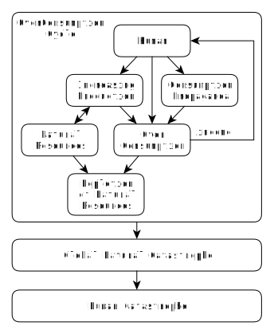

# Чрезмерное Потребление против Человечества: Часть 1 (Черновик)
by Simon Zolin, Nov 2020

Черновик.  [Полная версия на английском](overconsumption-vs-human-1.md).

О губительном воздействии нашего чрезмерного потребления на природу известно уже многим людям.  Вокруг нас продолжается нескончаемая гонка потребления.  В погоне за модой, статусом и самоудовлетворением от владения какой-либо вещью мы забываем, кто мы такие, и для чего мы живём на этой планете.  Не понимаем также, как долго мы вообще проживём на Земле, если оставим всё как есть сейчас, без изменений.  Но в итоге нам придётся это понять, хотим мы этого или нет.  Вопрос только в том, придёт это понимание к нам добровольно в ближайшее время, или позже, но уже принудительно.

Современная политика заставляет нас потреблять всё больше и больше.  В этом заключается суть всей этой системы - это её питает.  Остановится потребление - всё рухнет.  Рассмотрим, какова экономическая модель потребления сейчас:

* В центре диаграммы я ставлю человека, ведь только он и его личные потребности - главное в наше время.  Я не разделяю людей на классы и группы, т.к. это не имеет значения в данном случае - мы все, как единое целое, являемся строителями и в то же время заложниками нынешней системы.

* Современный человек хочет одного - денег.  В этом выражаются все его первобытные инстинкты - сладко спать, вкусно жрать, безудержно потешаться, сохраняя максимальную безопасность себя любимого от всяких неприятностей.  Но как это всё получить?  Нужно что-то продать - нужно иметь товар.  Вот мы приходим к термину "потребление" - это когда один человек у другого что-то купил, и продавец получил выгоду, и покупатель рад.

* Но чтобы продать товар, нужно его создать.  Появляется "производство".  Здесь я называю товаром не только то, что можно взять и пощупать, но и услуги (например, стрижка у парикмахера).

* Произвести физический товар можно только имея строительный материал.  А откуда его взять?  Тут на помощь (пока что безвозмездно, в кредит) приходит человеку природа, в виде "природных ресурсов".  Он у неё берёт материал (например дерево) и производит товар, который потом продаёт.

* После продажи товара у продавца появляется доход в виде дополнительной стоимости за свою работу.  А покупатель платит за этот товар по своей воле, потому что он ему нужен.  Это абсолютно нормально и справедливо, т.к. затем этот продавец на полученные средства купит нужный ему товар у других продавцов.  Круг замыкается.

* Ещё раз кратко проговорю весь процесс, описанный выше: человек производит товар, используя ресурсы природы, затем продаёт этот нужный покупателю товар и получает прибыль, которую использует на приобретение товаров, необходимых ему самому.

* Но вот у человека появляется чувство жадности, и он начинает думать как бы ему свой доход увеличить.  Ответ прост: нужно, чтобы увеличился спрос на его товар.  Чтобы это сделать, необходимо нарастить производство (в т.ч. количество людей, занятых в этом деле), а значит и увеличить использование природных ресурсов.  Представим, что дело сделано, и теперь на рынке появилось очень много товара, который все непременно должны купить, и тогда человек станет богатым - т.е. придёт к главной цели своей жизни.

* Однако товар не продаётся, спрос на него невысокий, потому что он никому в таком количестве не нужен, и процесс богатения продавца приостанавливается.  Нужно что-то делать, ведь нельзя так оставить человека без дополнительного счастья!  И вот тут появляется машина "пропаганды потребления" - катализатор спроса на товар, сильное оружие капиталиста перед массовым обывателем.  Если раньше спрос на качественный товар появлялся в результате его полезности, то сейчас ни качество, ни польза товара не определяют спрос на него.  Нужный эффект достигается с помощью современных достижений в области рекламы.  В итоге спрос нагревается до необходимого уровня и денежки в карман бизнеса начинают течь рекою.  Причём, рекламой я называю не только обыкновенные рекламные блоки и ролики.  Она менее опасна, т.к. человек понимает, что это действительно называется "реклама", и её цель - побудить к потреблению.  Но есть и скрытая, коварная реклама, которая работает намного сильнее и глубже проникает в сознание.  Это и художественные фильмы, и "умные" передачи по ТВ, и разного рода поучительные статьи в Интернете, журналах и газетах, и даже мы с вами.  Вот самый простой пример.  В фильме главный герой много курит, и делает это так красиво, так круто, что дети непременно хотят тоже это попробовать, а ведь в реальности все дети знают, что курение - это вредная привычка взрослых, и нет в этом абсолютно ничего "крутого".  В передачах по ТВ показывают как нам нужно модно одеваться, по новостям навязывают политическое согласие.  Множество блогов в Интернете имеет цель не научить чему-то полезному, а навязать определённое мнение, в том числе политическое.  Здесь всё зависит от того, в чьих интересах действует медиа контент, а точнее создатель этого содержания - человек.  Снова обращаемся к описанию человека, приведённому выше, и выясняем, что действует он в интересах денег.  Иными словами - кто больше ему заплатил, того интересы он и представляет.  Эта система - идеальная среда для тех, у кого денег больше, они и имеют в ней реальную власть.  А теперь о нас с вами.  Наше поведение и наш образ жизни, изначально навязанные рекламой ещё в детстве, в свою очередь тоже являются рекламой, но уже для окружающих нас людей.  Так и формируется общество, в котором приняты именно такие моральные устои, где основная цель - просто что-то купить и тем самым повысить свой статус.

Но есть и другая реклама, которую мы не всегда можем распознать.  При этом она работает намного сильнее и глубоко закрадывается в наше сознание.  Она живёт в нас на протяжении всей нашей жизни и даже передаётся из поколения в поколение.  И это - идеология.  Но если принципы поведения в обществе меняются - следом и начинает сильно меняться весь мир.  И в какой-то момент времени победу одержала идеология капитализма.

* Но вернёмся к нашей диаграмме и рассмотрим какой же результат даёт пропаганда потребления.  При искуственно подогретом (либо вообще искуственно созданном) спросе, потребление увеличивается до уровня "чрезмерного потребления".  Т.е. такое количество товара на самом деле людям не нужно!  Но нынешняя система заставляет их его купить.  Всё вокруг нас неустанно работает ради этого.  Кажется, что мы сами делаем этот выбор - покупаем что нам нужно, в том количестве, которое нам необходимо.  Но к сожалению, это лишь отчасти так.  Да, товар может быть действительно нужным и полезным, но здесь речь именно о количестве.  У многих из нас по 5, а то и больше мобильных телефонов было, причём не всегда покупка нового девайса осуществляется только после выхода из строя предыдущего.  С помощью рекламы нам вселяют непреодолимое желание купить новый, ведь там экран больше, и смайлики новые в прошивку завезли.  Те, кто уже купил новую модель, пользуются повышенным вниманием и уважением, т.е. плюс к своему статусу.  А те, кто ещё не купил - купят, когда поймут, что они - изгои, вне элитной тусовки.  И поди им объясни, что у них старый телефон ни чуть не хуже работает - не в этом дело ведь.  И полбеды ещё, если человек обладает свободными деньгами и покупает на них новый модный товар.  Модный товар покупают ещё те, у кого денег совсем нет!  Для этого есть удобный финансовый инструмент под названием кредит.  Современный человек готов по своей собственной воле залезть в долг под проценты ради своего статуса, ради самоуважения, которое достигается через обладание вещью.  Ведь выше я писал, что других форм радости у него и нет вовсе.

* Итак, после фазы чрезмерного потребления увеличенный доход возвращается назад к человеку в виде дивидентов, зарплат, премий.  С одной стороны кажется, что это хорошо, ведь наш человек только для этого и живёт.  Но есть и другая сторона, и называется она "истощение природных ресурсов".  Вот он, этот негативный результат, губительный выхлоп того цикла потребления, который существует сейчас.  Этот выхлоп, подобно токсинам, накапливается на нашей планете, в конечном счёте сведёт на нет все технологические прорывы, которыми мы так сегодня гордимся.  Ведь зачем нам нужна будет Интернет видео связь, когда нам нечего будет кушать и нечем отапливать жильё?  Или на космическую отрасль вся надежда, что авось успеем улететь куда-то?  Отсутствие культуры потребления приводит к тому, что в нашей экономической модели нет места заботе о природе Земли (поэтому и нет в моей диаграмме слова "природа", а есть только "природные ресурсы").  Наоборот, приветствуется использовать максимум её ресурсов, выжать из неё последнее ради пачки вкусно-пахнущей зелёной бумаги.  И всем всё равно, если эти ресурсы трудно восполнимы, и что с результатами нашей политики будут делать наши потомки - да как-нибудь разберутся уж?  Мда, дальновидно, ничего не скажешь.

* Пройдёт время и этот цикл потребления начнёт сбавлять темп, в следствие чрезмерного истощения ресурсов.  Вечно это не может продолжаться.  Мы все понимаем, что когда-нибудь этому придёт конец.  Начнутся экономические кризисы, беспорядки, массовые забастовки, драки.  Ведь при такой системе любое снижение потребления - равносильно обострению болезни.  Но даже это не послужит для нашего человека красным сигналом к остановке.  К тому же, уже сейчас можно наблюдать как этот человек не способен принимать разумные решения.  Он настолько привык брать и не давать ничего взамен, что другого пути он просто не знает, и никогда не знал.  В итоге природа начнёт требовать от человека, столь долго живущего в кредит от её ресурсов, вернуть долг, да ещё и с набежавшими процентами.  И в этот момент пощады не будет никому.  Это будет глобальная природная катастрофа.

* А следующая за природной катастрофой - наша, катастрофа для человека.  Ведь мы забыли, что человек - это тоже часть природы, всего лишь один вид млекопитающих, живущих на планете.  Мы привыкли думать, что мы отдельно, сами по себе существуем.  Но это не так, и в глубине души все это знают.  Смена климата приведёт к проблемам в сельском хозяйстве, к проблемам с едой, к миллиардам смертей.  Это если не брать в расчёт неизбежные междуусобицы, вызванные повышением конкуренции за землю, продовольствие.  Люди будут убивать друг друга, чтобы оказаться в числе первых на собеседование к работодателю, который будет платить за труд едой.  Не знаю как вы, но я бы не хотел оказаться в таком времени.

Итак, мы рассмотрели систему, которая действует у нас сейчас, и которая распространена почти по всей планете.  Кратко повторю в чём её суть: жадный человек, в погоне за своим единственным счастьем, деньгами, создаёт условия, в которых другой человек вынуждается к покупке ненужного ему товара, создавая тем самым дополнительный доход для продавца.  При этом используется как можно больше природных ресурсов, что приводит к их истощению, а затем к катастрофе.  Эта модель не может существовать вечно (возможно, она проживёт ещё каких-то 100 лет), и она с самого начала обречена на провал, она доведёт человечество до крайней ситуации.  Но неужели ничего нельзя сделать заранее, чтобы предотвратить катастрофу?  Можно и нужно!
