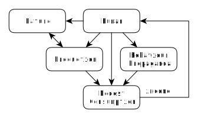

# Чрезмерное Потребление против Человечества: Часть 2 (Черновик)
by Simon Zolin, Dec 2020

Черновик.  [Полная версия на английском](overconsumption-vs-human-2.md).

## Система будущего

Теперь рассмотрим другую модель, особенностью которой является то, что она не приводит к тотальному коллапсу с течением времени:

Наверху диаграммы по-прежнему расположен "человек", но рядом с ним теперь находится "природа".  Я ставлю их на одну ступень, высшую ступень, т.к. в этой модели человек - не единоличное эгоистическое существо, а часть природы.  Он понимает это и потому заботится о ней как о своей семье, как о себе самом.  Забота о природе может проявляться самыми разными способами: это сокращение добычи ресурсов, сокращение охоты на животных, ловли рыбы, сокращение выбросов вредных отходов в воздух и водоёмы.  Причём сокращение до такого уровня, когда это перестаёт являться губительным действием.  Человек по-прежнему ловит рыбу, но делает это в меру, не нанося непоправимый ущерб.  Этот человек не выбрасывает, а перерабатывает вредные отходы; не наращивает, а оптимизирует вредное производство посредством введения новых эффективных технических решений.  Эффективных не с точки зрения прибыли, а с точки зрения воздействия на окружающую среду.  И ничего кроме жадности и алчности этому не противоречит, да и сами эти понятия нашему человеку противны до глубины души.  Но как так получилось?

Ведь здесь тоже существует "производство", есть и "потребление", и доход человеку возвращается в виде заработных плат и премий - на первый взгляд, всё как и в предыдущей модели.  Однако здесь - "производство" вместо "сверхпроизводства".  Здесь - "умеренное потребление" вместо "сверхпотребления".  И причина этой разницы в одном - культуре, а именно в "пропаганде культуры".  Причём культурой здесь я называю не музыку, театр и кино, т.е. творчество, а моральные основы общества, в т.ч. мировоззрение.

### О культуре общества

Обратите внимание, что человек в обоих вариантах - один и тот же по сути, это homo sapiens.  На свет рождается млекопитающее существо, обладающее очень сильным природным инстинктом к выживанию в окружающей среде и адаптации к ней.  Мозг человека способен запоминать бесконечное количество информации в виде образов и ассоциаций, оперировать ею со скоростью света.  Мы можем в один лишь миг решать сложнейшие задачи, которые и суперкомьютерам не под силу.  И наибольшее количество информации закладывается в мозг именно в детстве.  Природа настроила нас таким образом, чтобы первые годы нашей жизни мы учились выживать в новых условиях, какими бы они ни были.  В первые секунды после появления на свет мы получаем массу микробов и вирусов, и сразу же встроенный в нас иммунитет начинает свою работу - борьбу за выживание.  И он этим занимается всю нашу жизнь, без остановки.  Природа освободила нас от всего, что могло бы нам помешать в жизни - мы дышим, и наше сердцебиение автоматически работает, даже когда мы спим.  Все внутренние органы работают как бы сами по себе - мы не контролируем их напрямую.  А ведь внутри нас работает гигантский химический завод невообразимой сложности!  И наше сознание, свободное от всех этих рутинных операций, дано нам с одной единственной целью - мыслить, чтобы выжить.  Мы сознательно должны принимать те или иные решения, опираясь на всю поступающую к нам информацию извне.  И мы учимся всему вокруг, для того чтобы принимать всё более и более эффективные и разумные решения.  Мы перестаём повторять ошибки прошлого, т.к. в нашем сознании ещё свежа боль от их результатов, свежи те неприятные воспоминания.

В конечном счёте, победив проблемы выживания нашего рода, обеспечив себе безопасное жильё, здоровый сон и питание, у нас появляется свободное время для того, чтобы заниматься тем, что нам нравится.  И вот за это человек награждается особенным, человеческим счастьем, недоступным для всех остальных млекопитающих, живущих на нашей планете.  Ведь если даже представить на минуту, что вокруг нас нет больше ничего другого, то мы будем получать удовольствие только лишь от разговора с интересным собеседником.  И ничего нам больше не надо для истинного счастья!  Конечно, чем выше интеллект в обществе - тем интереснее в нём проходит общение, тем большее удовольствие человек получает.  Интеллектуальное общество всегда стремится увеличить уровень своего развития, а также научить новое поколение, передать свои мудрость и опыт.  Оно поощрает и учит добру, упрекает и наказывает зло.  Таким образом в целом мы развивались до недавнего времени.

Но есть у человека и отрицательные черты, и к сожалению, они очень легко и естественным образом выползают наружу, если интеллект общества падает, либо падает вовлечённость общества в борьбу за образование.  Общество должно сознательно бороться за поддержание уровня своего высочайшего развития и делать это повсеместно и не останавливаясь.  Остановись этот процесс лишь на одно поколение - и мы тут же теряем половину всего наработанного веками опыта и мудрости.  И вот уже появится поколение людей, утративших способность к этой борьбе, потерявших понимание для чего общество должно жить, и какие обязанности оно должно выполнять.

Часть такой функции издревна выполняла религия.  Она объединяла людей, пропагандировала некие общие традиции, создавала правила жизни для народа.  Большинство заповедей любого религиозного направления имеет под собой вполне логичные тезисы, которые и по сей день должны быть главным компасом в жизни любого из нас.  Под страхом кары божьей человека учат не совершать убийства, кражи и другие деяния, которые общество считает резко негативными.  Общество заинтересовано в процветании, а не в том, чтобы развалиться на части и по очереди сгинуть в небытие.  За тем и закреплялись эти правила в книгах, например в Библии.

Другая часть этой функции принадлежала общинным и государственным законам, где описывались возможные наказания для человека, который нарушил общественные правила.  Тогда каждый человек, задумавший совершить что-либо, заранее знал о своей ответственности за это деяние.  Он сознательно принимал то или иное решение, опираясь на эту информацию.

В любом случае, общество контролировало своё собственное поведение для того, чтобы существовать и развиваться дальше, это закон самосохранения.  Это являлось древней пропагандой культуры.

Однако и религия, и государственные законы в какой-то момент времени подверглись деформации.  Служители религии забыли о том, что именно они должны проповедовать.  Законы стали служить не обществу, а отдельным правящим субъектам.  В результате этого общество с течением времени, со сменой поколений, потеряло ту моральную опору, которая изначально создавалось предками для его защиты, защиты своего потомства.  Наши предки разумно считали и верили, что их ошибки не будут повторяться их детьми.  Но приходит новое время, сменяются поколения, правители, резко меняется глобальная ситуация в мире, и вот уже новые люди, живущие в новых странах, по-прежнему сталкиваются с теми же самыми проблемами.  Им заново приходится их решать, и хорошо хотя бы, если они опираются на опыт древних лет.

Сейчас, используя всю техническую мощь современного прогресса, мы способны раз и навсегда положить конец порочному кругу в области культуры и её пропаганды, а точнее, её отсутствия.  Совместно с психологами, воспитателями и учителями создать, наконец, ряд тезисов, простых и понятных каждому, которые мы обязаны вдалбливать в голову своих детей и строго (но не жестоко) наказывать за каждое их нарушение.  К тому моменту, когда человек созревает и начинает действовать полностью осмысленно, опираясь уже не на указы родителей, а на свой собственный разум, в его сознании уже прочно выбиты законы общества, в него залит плотный и непоколебимый фундамент культуры этого общества.  Именно в детстве формируется мировоззрение человека, поэтому не только родители, но и всё взрослое общество обязано передавать культуру новому поколению.  Даже животные, являясь родителями, инстинктивно обучают своё потомство правилам жизни, правилам охоты, если это хищник.  Однако по-видимому, многие люди забыли об этой своей обязанности, хотя точнее, нас заставили это сделать.

### Культура будущего

Итак, что же конкретно подразумевает моё представление о пропаганде культуры общества будущего?  В первую очередь - отсутствие пропаганды потребления.  Проще говоря, никто и нигде не заставляет человека будущего что-то купить.  Человек сам принимает решение, что ему что-то действительно нужно и руководствуется своей головой.  Он выбирает тот товар, качество которого его устраивает, а не тот товар, марку которого поселила в его подсознании реклама.  Реклама не побуждает его пойти и купить какой-то товар определённого брэнда.  Вместо этого, она лишь объясняет реальную пользу, которую данный товар человеку приносит.

Например, нет рекламы "купи мыло фирмы Х, потому что оно - лучшее", но есть рекламные ролики, где показывается, что необходимо соблюдать собственную гигиену, что это очень важно для здоровья, и как именно здесь помогает мыло.  Нет рекламы "пылесосы фирмы Х - самые мощные", зато есть мини-фильмы, где описывается, что такое пыль, отчего и как она появляется, как с ней бороться, и какова польза пылесосов в этой борьбе.  Вместо рекламы картофельных чипсов и сладкой газировки... ничего!  Ведь производители данных товаров не смогли никому объяснить чем их товары полезны.  Пролежав в магазинах на полках в самом отдалённом углу месяц, эти товары перестали закупать магазины, и компании давным давно перепрофилировались в другие отрасли, чтобы избежать банкротства.

Наш человек не болеет ни диабетом, ни ожирением, т.к. доза сахара в его еде соответствует здравым нормам, о чём крупно чёрным по белому записано на этикетке каждого товара.  Он также редко болеет сердечными заболеваниями, т.к. имеет массу свободного времени, и проводит его на природе с друзьями и гуляет на свежем воздухе.  А откуда у него столько свободного времени?  Он закончил свою работу в час дня и теперь волен заниматься другим своим хобби.  Почему "другим"?  Потому что его основная работа - его основное хобби, и занимается он им исключительно ради собственного удовлетворения, плюс к тому же получая за это соответвующую денежную премию, которую он затем тратит на необходимый ему товар.  Те люди, которые по каким-то причинам не нашли подходящую работу по своим желаниям и возможностям, вынуждены довольствоваться работой менее подходящей, но обладающей спросом на рынке труда.  Но этот человек знает, что всё общество заинтересовано в том, чтобы каждый занимался своим любимым делом, ведь только в этом случае достигается максимальная эффективность труда, а значит общество в итоге получает самый качественный товар.  Я даже не возьмусь представить и рассказать про тот высочайший уровень жизни, который можно получить в условиях, где основной показатель товара - именно качество.  Те же редкие люди, которые по причине своей умственной отсталости обладают безграничной жадностью и алчностью до денег, работая на ненавистной ему работе, где дают чуть больше премии, вызывают у общества неприязнь, брезгливость и осуждение.  Они видят этого несчастного человека и по возможности помогают ему осознать, что счастье - это получение удовольствия от общения с близкими, а также от своей любимой работы и хобби, и никак иначе.

Законы этого общества с детства разъясняются каждому человеку его родителями, затем их проходят в школах каждый день первым уроком, по ним сдают экзамены, ведь это - основа, самая первая ступень развитого общества.  Их обсуждают в каждом СМИ, о них кратко, но доступно рассказывают перед каждым фильмом и передачей.  И в этих законах нет ни слова о штрафах, лишениях свободы и прочих страшных вещах - это лишь в небольших книжках для прокуроров и судей, которые редко даже открываются.  Здесь же законом называется в первую очередь "культурный закон".  То, что в простой форме объясняет детям правила их поведения в обществе.  Конечно, нет здесь и глупых норм этикета "как правильно держать кружечку чая, оттопыривая при этом мизинец", но есть понятные объяснения, например почему нельзя сорить где бы то ни было, или почему нельзя шуметь по ночам в квартире, или почему нужно быть вежливым и помогать друг другу, и не менее важное - как уважать и заботиться об окружающей среде.  Дети это запоминают и начинают следовать этим указам, в начале - бессознательно, опасаясь того, что родители их накажут.  Затем - осознанно, понимая, что он - часть большого общества, где все выбрали жить по этим законам, а значит все обязаны их соблюдать.  В итоге в этом обществе почти нет насилия, нет огромного количества преступлений, т.к. они совершаются лишь редкими умственно отсталыми либо психически больными людьми, которых принудительно затем лечат.

В этом обществе особую роль играет отношение человека к природе.  У него и в мыслях нет как-то отравить природу, слить отходы в реку, сжечь химический мусор, выловить и выпотрошить всю рыбу ради икры.  Здесь каждый отчисляет часть своего дохода на научные исследования в области повышения эффективности техники для уменьшения губительного влияния на природу.  Проводятся работы, в том числе и безвозмездные, по собственному желанию, где люди рассаживают деревья там, где ещё не успели это сделать после страшной разрушительной эры капитализма, убирают остатки его "деятельности", т.е. мусора.  Разводят рыбу в реках, морях и океанах, восстанавливая природный баланс.  Отправляют в бумажную переработку последние рваные пожелтевшие клочки зелёной бумаги, некогда являвшейся символом власти у неразумного человека прошлого.  Это общество нацелено на долголетие, на процветание на миллион лет вперёд, не опасаясь никакой катастрофы в ближайшем будущем в результате своей же деятельности.  Это - общество будущего.

## Заключение

Итак, описанная здесь экономическая модель с такими моральными принципами общества является на мой взгляд единственным правильным и возможным вариантом продолжения человеческой истории.  Конечно, эпоха капитализма дала какие-то положительные результаты, например технический прогресс в результате искуственно созданной гонки между компаниями, между народами, живущими на нашей планете.  Но эта эпоха переходит в свою завершающую стадию, потому что её необходимое условие - паразитирование на обществе и на природе - уже не может держаться на достаточном уровне для дальнейшего роста всей этой системы.  Ресурсы природы и терпение народных масс вскоре будут исчерпаны, и пора задуматься о следующей стадии развития современного общества, где центром является интерес всего общества, а не интерес кучки алчных субъектов.  Но ещё раз подчеркну, что по моему мнению это развитие невозможно с современной идеологией общества, где правят жадность и эгоизм.  И это является самой коренной проблемой сегодняшнего мира.  Но всё в наших руках, ведь уже сегодня мы можем воспитывать новое поколение по новой идеологии, учить сопротивляться всей этой пропаганде потребления, объяснять, почему важно бережно относиться к природе и её ресурсам.  Когда б'ольшая часть общества начнёт следовать единственно разумным принципам и будет объединена по этим принципам в одно целое, это общество выстроит соответствующую политическую и экономическую систему будущего, где природа будет другом человека, а не его рабом.

## Фильм Дэвида Аттенборо

В этом году вышел фильм известного английского исследователя Дэвида Аттенборо, в котором он указывает на текущие проблемы в области истощения природных ресурсов и её загрязнения.  Этот фильм является также его пророчеством, его видением того будущего, которое ожидает человечество, в случае если не предпринимать никаких решительных мер.  И этот фильм побудил меня на написание этой статьи, правда я пытаюсь представить эту проблему несколько шире, объяснить её причину.  Да, в фильме прослеживается взаимосвязь между причиной и следствием, но к сожалению в нём не хватает чёткости и определённости позиции.  Нет простого и понятного вывода о том, кто же виновник всего происходящего, и каково должно быть решение.  На мой взгляд, вывод такой.  Природу губит капитализм, а именно сверхпотребление, пропагандируемое им.  При текущем уровне потребления и загрязнения природы на нашей планете вскоре произойдёт катастрофа.  Для того, чтобы эту катастрофу предотвратить, необходимо сократить потребление.  Но это потребление при текущей культуре общества сократить невозможно!  Мы все насильно втянуты в гонку, и из неё выйти не так уж и просто.  Поэтому снова мы приходим к коренной проблеме - образованию и воспитанию.  Если мы эту проблему не решим, жить на нашей планете вскоре станет тяжело, а может и даже некому.  Я не могу описать своим текстом ту красоту нашей планеты, которую мы сегодня губим в результате деятельности современного человека, но фильм Дэвида это показывает вполне точно.
